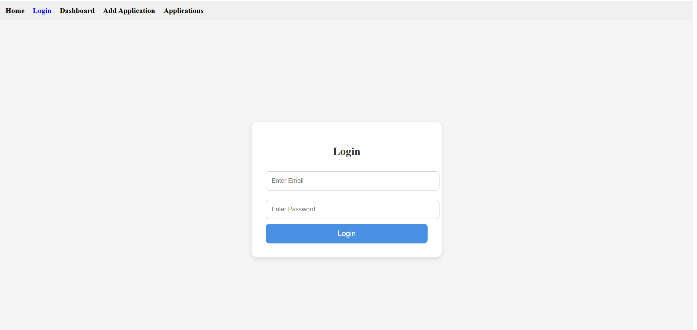
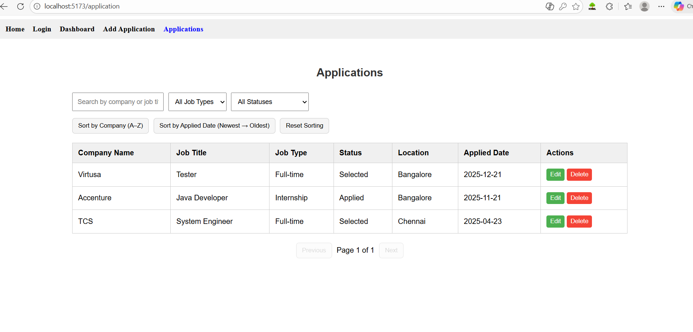
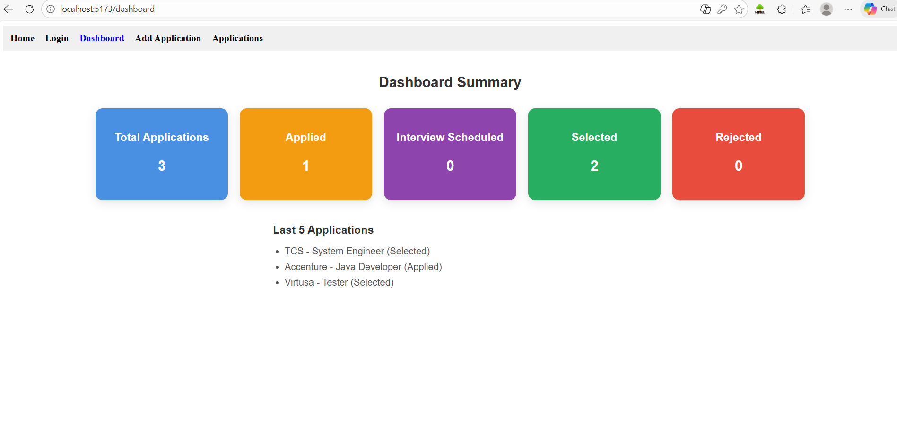

# Job Tracker

## Project Description
Job Tracker is a React-based web application that helps users manage and track their job applications. Users can log in, add new applications, view all applications in a table, filter, search, sort, and get a summary of application statuses in a dashboard.

The project demonstrates frontend development with React, routing with React Router DOM, state management using React Context API, and CRUD operations in the frontend.

---

## Tech Stack
- **Frontend:** React, JavaScript, HTML, CSS  
- **Routing:** React Router DOM  
- **State Management:** React Context API  
- **Deployment (Optional):** Netlify / Vercel / Render  

---

## Features Implemented

### User Authentication
- Login page with email and password  
- Protected routes for Dashboard and Applications pages  

### Applications Page
- Display applications in a table with columns:
  - Company Name
  - Job Title
  - Job Type
  - Status
  - Location
  - Applied Date
- **Search:** Case-insensitive search by company name or job title  
- **Filter:** Dropdown filter by Job Type and Status  
- **Sorting:** 
  - Sort by Company (A–Z)  
  - Sort by Applied Date (Newest → Oldest)  
  - Reset sorting  
- **Pagination:** 5 applications per page with Previous/Next buttons  
- **Actions (Bonus):**
  - Edit application inline via prompt  
  - Delete application  

### Dashboard Summary
- Summary cards showing:
  - Total Applications  
  - Applied  
  - Interview Scheduled  
  - Selected  
  - Rejected  
- Bonus: Last 5 applications displayed in a list  

---

## Screenshots

### Login Page


### Applications Table


### Dashboard Summary


---


## How to Run Locally
1. Clone the repository:  
```bash
git clone https://github.com/your-username/job-tracker.git
